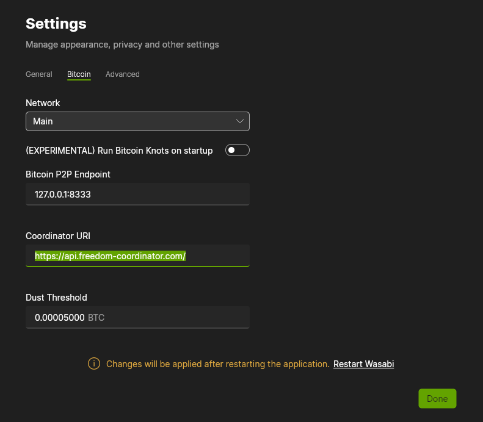

# Freedom coordinator 🐉

As of June 1st of 2024 the default [Wasabi Wallet](https://wasabiwallet.io/) [coinjoin](#what-is-a-coinjoin-) coordinator will [cease to operate](https://blog.wasabiwallet.io/zksnacks-is-discontinuing-its-coinjoin-coordination-service-1st-of-june/)  
Freedom coordinator is an **alternative coinjoin coordinator**  
Free as in free to use - **0% coordinator fee**, you only pay for network fees!  
We do not and never will blacklist UTXOs!  
Other coordinators can be found at [wabisator.com](https://wabisator.com/)

## Usage 🔧

To use Freedom coordinator as Wasabi Wallet coinjoin coordinator
- Update Wasabi Wallet to newest version
- Start Wasabi Wallet
- Open 'Settings' from bottom left corner
- Click on 'Bitcoin' tab
- Change 'Coordinator URI' to `https://api.freedom-coordinator.com/` as shown in image below
- Click 'Restart Wasabi'

## What is a coinjoin? 🤷

From Wasabi Wallet [docs](https://docs.wasabiwallet.io/using-wasabi/CoinJoin.html)
> A [coinjoin](https://en.bitcoin.it/Privacy#CoinJoin) is a special Bitcoin transaction where several peers get together to literally join their coins in a single transaction. They collaboratively build a transaction where each of them provides some coins as inputs, and fresh addresses as outputs. The concept has been around since the early days of Bitcoin, and it was formalized by the great Greg Maxwell in [this awesome introductory thread](https://bitcointalk.org/index.php?topic=279249.msg2983902)  
>
> The goal is to gain privacy by breaking the link of which input "pays" which output so that none of the outputs can be attributed to the owner of the input. WabiSabi enables centrally coordinated coinjoins with variable amounts in a trustless (meaning nobody can steal) and private (meaning even the coordinator cannot spy) manner, as described in the [WabiSabi paper](https://eprint.iacr.org/2021/206)
>
>   
>
> Click to play video

## Contact

[me@freedom-coordinator.com](mailto:me@freedom-coordinator.com)

## Blog

03/06/2024
> Our first [test coinjoin](https://mempool.space/tx/b41a2251c05e0599176cd722bebfdc8272dbb3b55437e82d409c3bc449922530)

05/06/2024
> Release!
